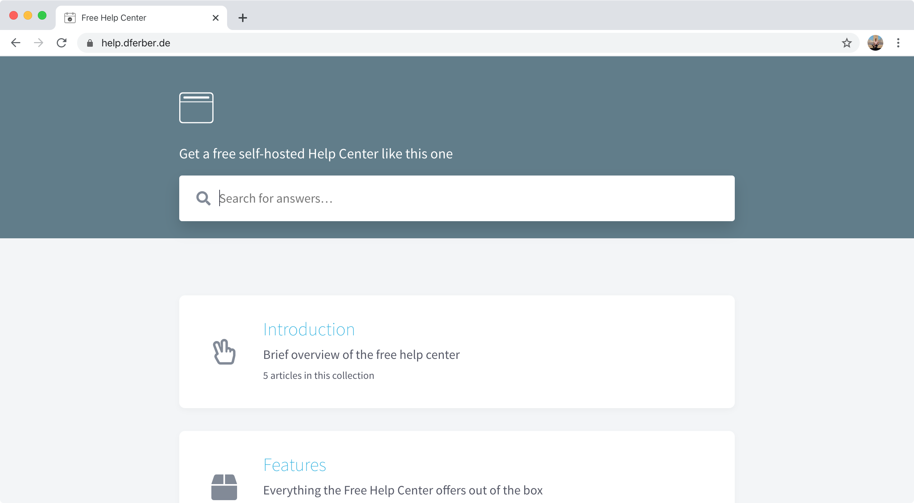

# gatsby-starter-help-center

Kick off your project with this help center boilerplate. This starter ships with the main Gatsby configuration files you might need to get up and running blazing fast with the blazing fast app generator for React.



_This README is a brief overview only. You can find the **full documentation** at [help.dferber.de](https://help.dferber.de/). That documentation site was built with this help center. Visit it to see what the help center looks like in production._

## 🚀 Quick start

1.  **Clone the starter.**

    Use the Gatsby CLI to create a new site, specifying the help center starter.

    ```shell
    # create a new Gatsby site using the help center starter
    gatsby new help-center dferber90/gatsby-starter-help-center
    ```

1.  **Start developing.**

    Navigate into your new site’s directory and start it up.

    ```shell
    cd help-center/
    gatsby develop
    ```

1.  **Open the source code and start editing!**

    Your site is now running at `http://localhost:8000`!

    _Note: You'll also see a second link: _`http://localhost:8000/___graphql`_. This is a tool you can use to experiment with querying your data. Learn more about using this tool in the [Gatsby tutorial](https://www.gatsbyjs.org/tutorial/part-five/#introducing-graphiql)._

    Open the `help-center` directory in your code editor of choice and edit `content/articles/welcome/index.md`. Save your changes and the browser will update in real time!

## 🧐 What's inside?

A quick look at the most important files and directories you'll need to edit.

    .
    |____README.md
    |____gatsby-config.js
    |____content
    | |____welcome
    | | |____index.md
    | |____second-article
    | | |____some-image.png
    | | |____index.md
    |____assets
    | |____favicon.png
    |____data
    | |____collections.yml
    | |____authors.yml
    | |____avatars
    | | |____dferber.png
    | | |____amanda.jpg
    | | |____bert.jpg

1.  **`gatsby-config.js`**: This is the main configuration file for a Gatsby site. This is where you can specify information about your site (metadata) like the site title and description, which Gatsby plugins you’d like to include, etc. (Check out the [config docs](https://www.gatsbyjs.org/docs/gatsby-config/) for more detail).

2.  **`content/articles`**: This is the folder where you'll place your articles.

3.  **`data/collections.yml`**: This file defines the collections of your help center. Each article will belong to one collection. A collection consists of many articles. A collection can have different sections which its articles may belong to.

4.  **`data/authors.yml`**: This file is where you'll list your authors. Every author needs an id, a name and an avatar. You can add an author to each article.

5.  **`data/avatars`**: Place the author's avatars in this folder and use them in `authors.yml`.

## 🎓 Learning Gatsby

Looking for more guidance? Full documentation for Gatsby lives [on the website](https://www.gatsbyjs.org/). Here are some places to start:

- **For most developers, we recommend starting with our [in-depth tutorial for creating a site with Gatsby](https://www.gatsbyjs.org/tutorial/).** It starts with zero assumptions about your level of ability and walks through every step of the process.

- **To dive straight into code samples, head [to our documentation](https://www.gatsbyjs.org/docs/).** In particular, check out the _Guides_, _API Reference_, and _Advanced Tutorials_ sections in the sidebar.

## 💫 Example

Check out [this help center](https://help.dferber.de/), which was built with this starter.
