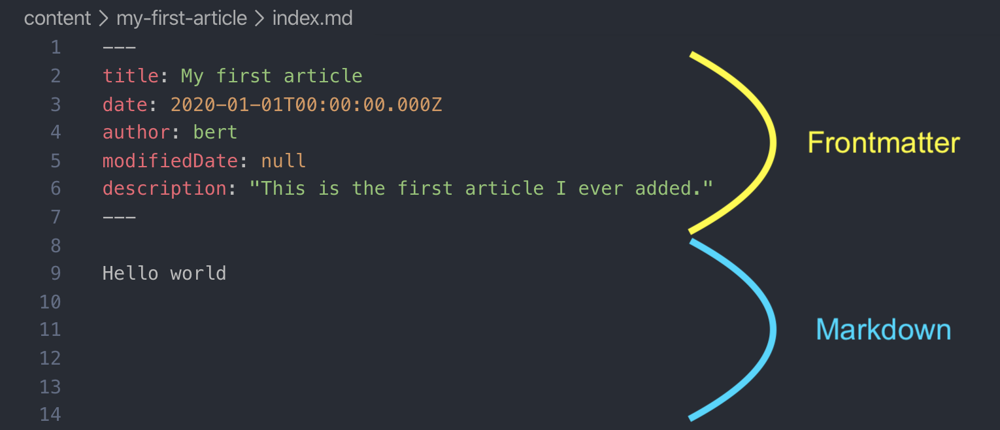

_This tutorial will show you how to add an article to your own help center. At the end, you will have added a new article to the help center running locally. The next section then shows how to edit the content. And the final step shows how to deploy the help center to the internet, so that anyone can access it._

### Prerequisites

You must have the help center running locally. See [this article](/articles/run-locally) if that's not the case yet.

### Preparing a folder

First you'll need to create a new folder inside `content`. The name of the folder will be the slug of your article. For example, when you create a folder called `my-first-article`, then your article will be accessible at `yourwebsite.com/articles/my-first-article`.

This folder will contain all assets of that article. The next step shows how to set up the content of your article.

_It is recommended to never change the name of a folder after an article has been created. If you change the folder-name afterwards, the slug would change. And that would mean everything link with the old location of your article would now break._

### Adding the article contents

Next, you'll need to create a file called `index.md` inside the folder you just created (`my-first-article` in our example). The `.md` file extension is called Markdown. Markdown is a special way to write text. It lets you add formatting and meta-information just by writing text.

Add the following content to your `index.md` file.

```md
---
title: My first article
date: 2020-01-01T00:00:00.000Z
author: bert
modifiedDate: null
description: "This is the first article I ever added."
---

Hello world
```

The stuff inside the `---` lines is called _front matter_. The _front matter_ is meta information about your article. It is written in a syntax called [`YAML`](https://en.wikipedia.org/wiki/YAML). Everything after that is used as the content of your article. It is written in a syntax called `Markdown`. The screenshot below may make this clearer:



### Previewing your article

You can now check out your newly created article by navigating to [http://localhost:8000/articles/my-first-article](http://localhost:8000/articles/my-first-article). We know the slug (the `/articles/my-first-article` part) since it is determined by the folder this article is in.

_We recommend you keep a flat hierarchy. Do not create subfolders as that will only make it more likely that you'll later break the URLs of your articles in case you inevitably reorganize your folder structure._

### Adding your article to a collection

Now that you've got an article, you'll want to add it to a collection. Open the file in `data/collections.yml`.

Around line 25 of that file you'll see a part which looks like this:

```yaml
- id: introduction
  title: Introduction
  description: Brief overview of the free help center
  icon: "FaRegHandPeace"
  articles:
    - file: ../content/welcome/index.md
```

You can add your newly created article to the `introduction` collection by appending it to the articles section there.

Add a new line at the end of the block so that this part looks like this:

```yaml
- id: introduction
  title: Introduction
  description: Brief overview of the free help center
  icon: "FaRegHandPeace"
  articles:
    - file: ../content/welcome/index.md
    - file: ../content/my-first-article/index.md
```

If you now go to [http://localhost:8000](http://localhost:8000) and open the _"Introduction"_ collection, you'll see your newly created article in the second position of that collection.

In the next section, you'll [learn more about how to manage collections, sections and their articles](/articles/managing-collections).
